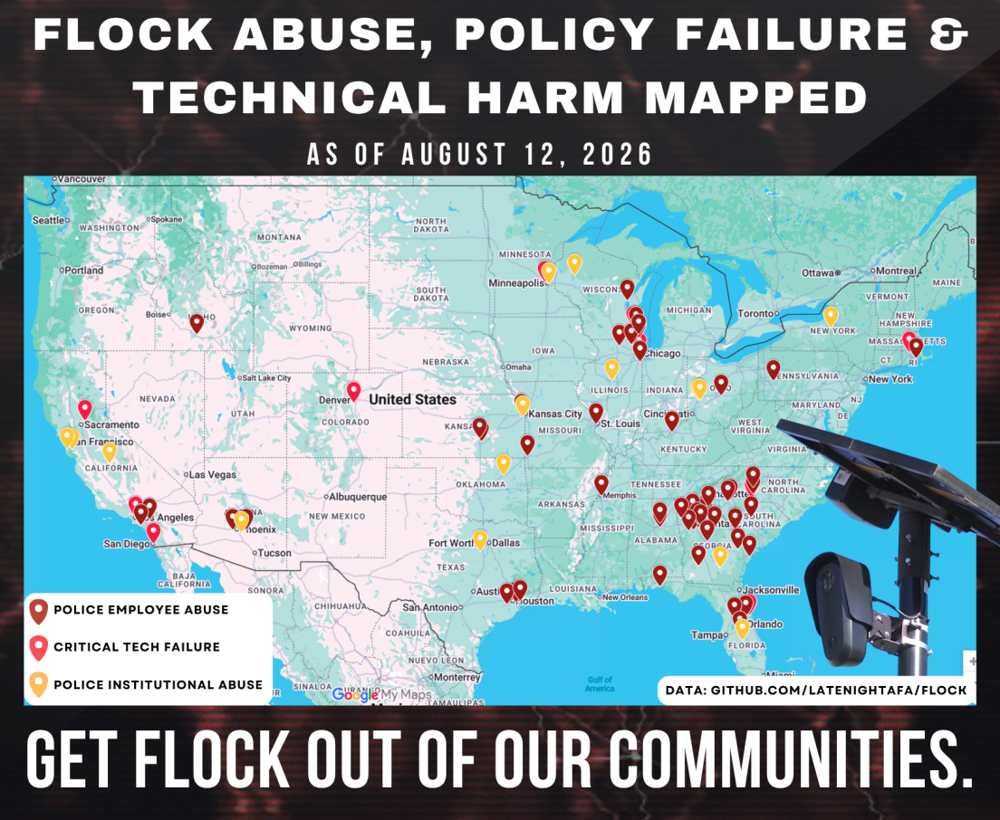

## Flock Abuse, Policy Failure & Technical Harm
This data was tracked through August 12, 2026.  
With Flock abuse revelations occurring at an astounding rate, this list will likely be out of date before the end of the day.  

### Included:  
* Flock Abuse, Policy Failure & Technical Harm data (through August 12, 2026)  
* Data separated by category for Google Maps import  

## [You can also click here to view as a spreadsheet.](https://drive.proton.me/urls/ZADSKMM9QG#1lWAnVYC0FvK )  

### Check out these resources to keep up:
* [LateNightAFA Flock Abuse Thread](https://bsky.app/profile/latenightafa.bsky.social/post/3mq4c65inek2j) | [Thread Unroll 1](https://skyview.social/?url=https://bsky.app/profile/did:plc:zoznoyofrqadb2i2l662ifhp/post/3ms4gbg7zns2p&viewtype=unroll) | [Unroll 2](https://skyview.social/?url=https://bsky.app/profile/did:plc:zoznoyofrqadb2i2l662ifhp/post/3ms4gbg7zns2p&viewtype=unroll)
* [Have I Been Flocked?](https://haveibeenflocked.com/)
* [DeFlock](https://deflock.org/)
* [EFF Atlas of Surveillance](https://www.atlasofsurveillance.org/)
* [404 Media](https://www.404media.co/)
* [Institute for Justice](https://ij.org/)
* [ACLU](https://www.aclu.org/)
* [StopFlock.org](https://stopflock.org/)
* [Footnote4a](https://footnote4a.org/)
